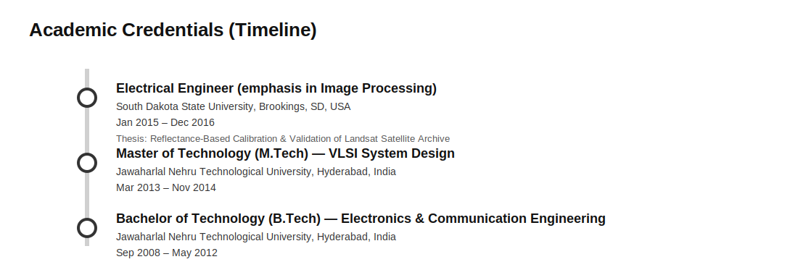

# Sandeep Chittimalli
**Senior Data Scientist | AI/ML Expert | Earth Science | Remote Sensing | Satellite Image Processing**

📍 United States  
📧 Sandeepkumarchittimalli@gmail.com  
🔗 [Google Scholar](https://scholar.google.com/citations?user=OO7rpLMAAAAJ&hl=en&oi=ao)  

---

## About Me

Sandeep Chittimalli is a seasoned Data Scientist and AI/ML expert with over a decade of experience driving innovation in Artificial Intelligence, Machine Learning, Remote Sensing, Satellite Image Processing, Earth Observations, Water Quality, and data science. He is currently leading AI/ML and data science initiatives at Synectics for a large federal organization in the United States and has a long-standing history of supporting high-impact federal research projects.

His past contributions encompass prestigious organizations including NASA, the US Geological Survey (USGS), and the South Dakota State University (SDSU) Image Processing Laboratories. With dual master’s degrees in Electrical Engineering and Electronics, Sandeep excels in architecting scalable data science environments, automating complex workflows, and delivering actionable insights through advanced AI/ML model deployment.

He brings deep expertise in applying artificial intelligence and machine learning across a myriad of applications, enhancing mission-critical decision-making in federal and research domains. Sandeep has vast experience working with both federal and academic research projects, successfully translating complex scientific and operational goals into data-driven solutions.

A recognized expert in the field, he has served as a judge and reviewer for multiple research and innovation events, known for his commitment to constructive, timely, and rigorous evaluations. He remains passionate about staying at the forefront of emerging trends in Artificial Intelligence, Machine Learning, and Data Science, continuously pushing the boundaries of what is possible with intelligent systems.

---

## Experience (Organizations/Institutions)

---

## Academic Credentials

  Master's Thesis: [Reflectance-Based Calibration and Validation of the Landsat Satellite Archive](https://openprairie.sdstate.edu/cgi/viewcontent.cgi?article=2104&context=etd)
  Advisor: [Dr. Dennis Helder] (https://www.sdstate.edu/directory/dennis-helder)
  
## Academic Projects
  Project 1: 3D Object and Image Modelling by Phase Shifting Profilometry and Gamma Correction.
  Project 2: Canon EOS 450D Radiometric Calibration.
  Project 3: Image Enhancement and Noise Removal using Adaptive Bilateral Filters.
  Project 4: Frame Synchronizer (A module which synchronizes and captures data coming from satellites).

## Resume
📄 [Download CV (PDF)](assets/Sandeep_chittimalli_Academic_CV_Updated.pdf)

---

## Highlights
➡️ [Certificates, Reviewing, Hackathons & AGU](highlights.html)

## Invitations, Talks & Presentations
➡️ [View invitations, talks, presentations & downloads](talks.html)

## Acknowledgements & Projects Supported
➡️ [View acknowledgements and supported projects](acknowledgements.html)

## Publications
➡️ [Journals, Conference Papers & Technical Reports](publications.html)

---

## Key Expertise
- Artificial Intelligence & Machine Learning
- Remote Sensing & Earth Observation
- Satellite Image Processing and Analysis
- Scientific Research & Federal Programs
- Water Quality
- Data Science
- Infrastructure architecture for scientific research projects
- NLP & Text Analytics
- Cloud-Native ML Systems (AWS)

---

## Volunteer Service & Memberships
➡️ [Program Committees, Peer Review & Memberships](service.html)
