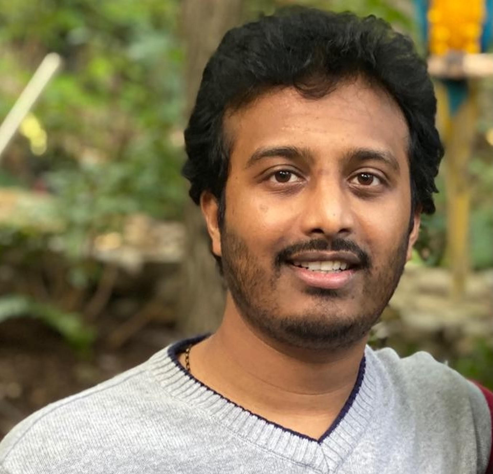

# Sandeep Chittimalli
**Senior Data Scientist | AI/ML Expert | Earth Sciene | Remote Sensing | Satellite Image Processesing **

📍 United States  
📧 Sandeepkumarchittimalli@gmail.com  
🔗 [Google Scholar](https://scholar.google.com/citations?user=OO7rpLMAAAAJ&hl=en&oi=ao)

---

## About Me

Sandeep Chittimalli is a seasoned Data Scientist and AI/ML expert with over a decade of experience driving innovation in Artificial Intelligence, Machine Learning, Remote Sensing, Satellite Image Processing, Earth Observations, Water Quality etc.... He is currently leading AI/ML and data science initiatives at Synectics for a large federal organization in the United States and has a long-standing history of supporting high-impact federal research projects.

His past contributions encompass prestigious organizations including NASA, the US Geological Survey (USGS), and the South Dakota State University (SDSU) Image Processing Laboratories. With dual master’s degrees in Electrical Engineering and Electronics, Sandeep excels in architecting scalable data science environments, automating complex workflows, and delivering actionable insights through advanced AI/ML model deployment.

He brings deep expertise in applying artificial intelligence and machine learning across a myriad of applications, enhancing mission-critical decision-making in federal and research domains. Sandeep has vast experience working with both federal and academic research projects, successfully translating complex scientific and operational goals into data-driven solutions.

A recognized expert in the field, he has served as a judge and reviewer for multiple research and innovation events, known for his commitment to constructive, timely, and rigorous evaluations. He remains passionate about staying at the forefront of emerging trends in Artificial Intelligence, Machine Learning, and Data Science, continuously pushing the boundaries of what is possible with intelligent systems.

## Academic Credentials

  

    
2015 – 2016

    

      <h4>Master of Science (MS) — Electrical Engineering (Image Processing)</h4>
      
<strong>South Dakota State University</strong>, Brookings, South Dakota, USA

      <ul>
        <li><strong>Project:</strong> 3D Object & Image Modelling using Phase Shifting Profilometry and Gamma Correction</li>
        <li><strong>Project:</strong> Canon EOS 450D Radiometric Calibration</li>
        <li><strong>Thesis:</strong> Reflectance-Based Calibration and Validation of the Landsat Satellite Archive</li>
        <li><a href="https://openprairie.sdstate.edu/cgi/viewcontent.cgi?article=2104&context=etd" target="_blank">View Thesis (OpenPrairie)</a></li>
      </ul>
    

  

  

    
2013 – 2014

    

      <h4>Master of Technology (M.Tech) — VLSI System Design</h4>
      
<strong>Jawaharlal Nehru Technological University</strong>, Hyderabad, India

    

  

  

    
2008 – 2012

    

      <h4>Bachelor of Technology (B.Tech) — Electronics & Communication Engineering</h4>
      
<strong>Jawaharlal Nehru Technological University</strong>, Hyderabad, India

      <ul>
        <li><strong>Project:</strong> Image Enhancement & Noise Removal using Adaptive Bilateral Filters</li>
        <li><strong>Thesis:</strong> Frame Synchronizer for satellite data capture</li>
      </ul>
    

  

---

## Resume
📄 [Download CV (PDF)](assets/Sandeep_chittimalli_Academic_CV_Updated.pdf)

---

## Highlights
➡️ [Certificates, Reviewing, Hackathons & AGU](highlights.html)

## Invitations, Talks & Presentations
➡️ [View invitations, talks, presentations & downloads](talks.html)

## Acknowledgements & Projects Supported
➡️ [View acknowledgements and supported projects](acknowledgements.html)

---

## Key Expertise
- Artificial Intelligence & Machine Learning
- Remote Sensing & Earth Observation
- Satellite Image Processing and Analysis
- Scientific Research & Federal Programs
- Water Quality
- Data Science
- Infrasturcture architech for Scienitifc research projects
- NLP & Text Analytics
- Cloud-Native ML Systems (AWS)
  
---

## Volunteer Service & Memberships
➡️ [Program Committees, Peer Review & Memberships](service.html)

