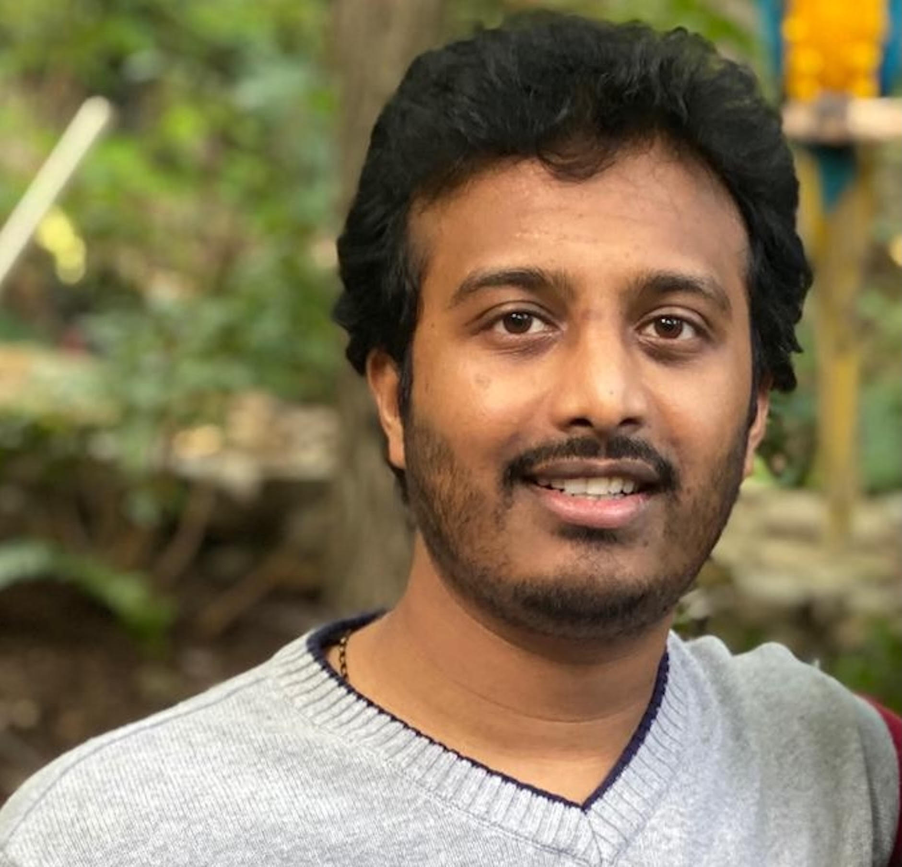
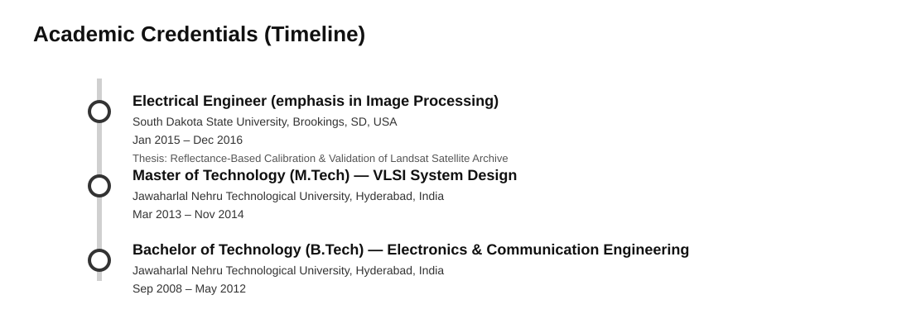

# Sandeep Chittimalli
**Senior Data Scientist | AI/ML Expert | Earth Science | Remote Sensing | Satellite Image Processing | Senior Member IEEE | IEEE GRSS Chair (East North Carolina Section) | Board Member | IET Advisor | AI Collective Chapter Lead**

📍 United States  
📧 Sandeepkumarchittimalli@gmail.com  
🔗 [Google Scholar](https://scholar.google.com/citations?user=OO7rpLMAAAAJ&hl=en&oi=ao)  

🔗[Linkedin](https://www.linkedin.com/in/sandeepkumarchittimalli/)

---

## About Me

Sandeep Kumar Chittimalli is a Senior Data Scientist and AI/ML expert with more than a decade of experience advancing Artificial Intelligence, Machine Learning, Data Science, Earth Science, Geoscience, Remote Sensing, Satellite Image Processing, and Earth Observation across federal, scientific, and academic research environments.

He currently leads AI/ML and data science initiatives at Synectics in support of a large U.S. federal organization, where he architects scalable data science environments and federal research infrastructure, automates complex scientific workflows, and develops and deploys advanced machine learning solutions. His work supports scientific research, geoscience, remote sensing, Earth observation, data-intensive computing, and mission-critical applications.

Sandeep serves as Chair of the IEEE Geoscience and Remote Sensing Society (GRSS), East North Carolina Section (ENCS), and is a Senior Member of IEEE GRSS. His broader professional leadership and service include serving as a Board Member of GCSAYN and Chair of its Research Committee Advisory Group, an Advisor to the IET Hyderabad Chapter, and Chair of the AI Collective Research Triangle Park, North Carolina Chapter. Through these roles, he contributes to research advancement, technical collaboration, professional engagement, mentorship, and the growth of scientific and AI-focused communities.

His professional and research contributions include work associated with NASA, the U.S. Geological Survey (USGS), and the South Dakota State University (SDSU) Image Processing Laboratory. With dual master’s degrees in Electrical Engineering and Electronics, he brings multidisciplinary expertise spanning AI/ML, scientific computing, geoscience, remote sensing, satellite imagery, image analysis, Earth observation, water quality, automation, and large-scale data processing.

Sandeep has extensive experience translating complex scientific, technical, and operational challenges into scalable, innovative, and data-driven solutions. His work bridges advanced AI/ML methodologies with geoscience, Earth science, remote sensing, satellite image processing, Earth observation, and scientific computing.

Beyond his technical work, Sandeep has served as a judge, reviewer, and panel member for numerous research, technology, and innovation initiatives, including the review and evaluation of proposals for federal innovation and research awards, as well as national and international conferences and peer-reviewed publications. Through these roles, he has contributed to the assessment of research quality, technical merit, innovation, and emerging technologies across science, engineering, artificial intelligence, machine learning, data science, geoscience, remote sensing, and related disciplines.

Through his technical leadership, research, professional service, mentorship, and community engagement, Sandeep remains committed to advancing Artificial Intelligence, Machine Learning, Data Science, Geoscience, Earth Observation, Remote Sensing, and intelligent scientific systems. His interests center on building practical and scalable AI/ML solutions, strengthening scientific and federal research capabilities, advancing remote sensing and Earth observation applications, automating data-intensive workflows, and applying intelligent, data-driven approaches to complex real-world challenges.

---

## Experience (Organizations/Institutions)

---

### Master’s Thesis

- **Reflectance-Based Calibration and Validation of the Landsat Satellite Archive**  
  📄 [View Thesis (OpenPrairie)](https://openprairie.sdstate.edu/cgi/viewcontent.cgi?article=2104&context=etd)  **Advisor:** [Dr. Dennis L. Helder](https://www.sdstate.edu/directory/dennis-helder), **Thesis Advisor:** [Larry Leigh](https://www.sdstate.edu/directory/larry-leigh)

### Academic Projects

- **Project 1:** 3D Object and Image Modelling using Phase Shifting Profilometry and Gamma Correction  
- **Project 2:** Canon EOS 450D Radiometric Calibration  
- **Project 3:** Image Enhancement and Noise Removal using Adaptive Bilateral Filters

  
### Bachelor’s Main Project
- **Project 4:** Frame Synchronizer — a module to synchronize and capture data from satellite streams

## Resume
📄 [Download CV (PDF)](assets/Sandeep_chittimalli_Academic_CV_Updated.pdf)

---

## Highlights
➡️ [Certificates, Reviewing, Hackathons & AGU](highlights.html)

## Invitations, Talks & Presentations
➡️ [View invitations, talks, presentations & downloads](talks.html)

## Acknowledgements & Projects Supported
➡️ [View acknowledgements and supported projects](acknowledgements.html)

## Publications
➡️ [Journals, Conference Papers & Technical Reports](publications.html)

---

## Volunteer Service & Memberships
➡️ [Program Committees, Peer Review & Memberships](service.html)
